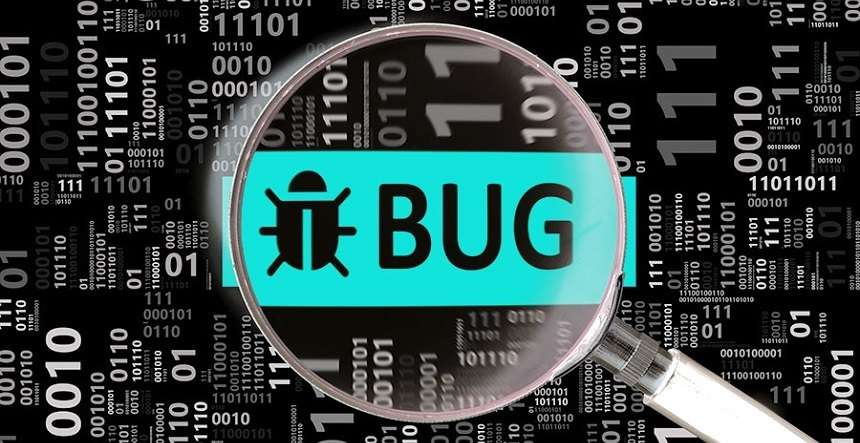

Iaorana la Polynésie!  

Foxit est heureux de présenter le premier programme Bug Bounty de la Polynésie.

## C'est quoi un Bug Bounty?

C'est un partenariat avec les hackers pour sécuriser votre infrastructure digitale. Les hackers cherchent en continue des vulnérabilités dans vos atouts, et dès qu'ils en trouvent, ils vous en font un rapport detaillé. 

## C'est quoi votre objectif?

Notre objectif est de sécuriser la Polynésie. On hack avant les pirates.

## Qui sont les hackers?

Les hackers sont des pratiquants de la cybersécurité offensive. Foxit vérifie tous les participants du programme pour assurer la qualité des tests.

## Comment s'inscrire?

Vous pouvez contacter l'email fenuahacking @ gmail.com.

